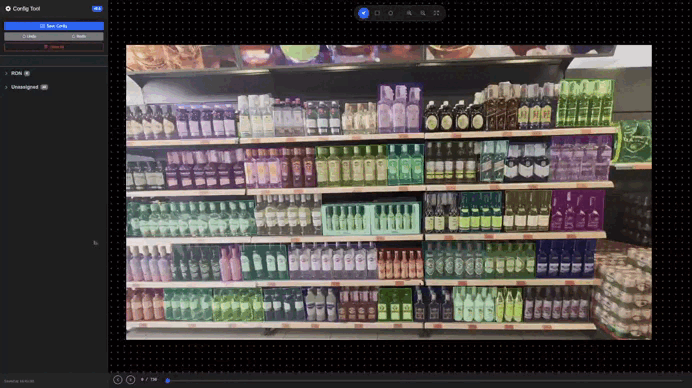

# Bottle Detection System


*Demonstration of the bottle detection and interaction system in action.*

## Structure
- `app/`: Main application code (inference and config server).
- `models/`: YOLO models.
- `scripts/`: Utility scripts (config tool, repair).
- `roi_images/`: Generated reference images for ROIs.

## Visuals

### Configuration Tool

*Web-based interface for defining Polygon ROIs.*

### Inference & Interaction

*Real-time detection, tracking, and hand-bottle interaction with similarity analysis.*

## Setup
1. Install dependencies:
   ```bash
   python3 -m venv venv
   source venv/bin/activate
   pip install -r requirements.txt
   ```
2. Ensure you have the following models in `models/`:
   - `model.pt` (Your Bottle Detection Model)
   - `yolov8n-pose.pt` (YOLO Pose)

## Usage

### 1. Configuration (Web-based)
Run the web server to configure ROIs.
```bash
python app/config_server.py <path_to_video>
```
- Open `http://localhost:5000`.
- Configure your ROIs and save.

### 2. Detection
Run the main detection system.
```bash
python app/main.py <path_to_video>
```
- The system will display the video with detections and the probability panel.
